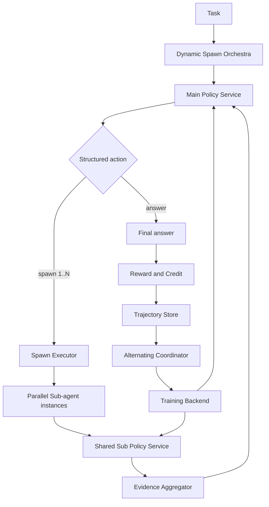
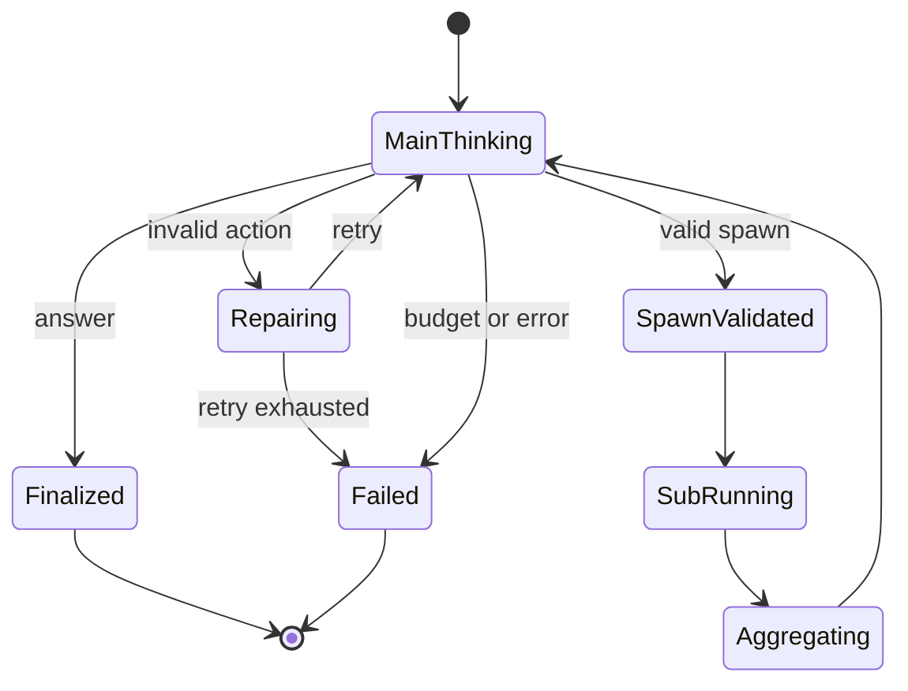

# HeteroSpawn-RL 项目设计书

> 暂定项目名：**HeteroSpawn-RL**  
> 文档状态：Architecture Baseline v0.3
> 目标读者：项目成员、本地 coding agent、后续复现实验人员  
> 文档目的：指导一个独立新仓库从零实现“异构 Main/Sub、动态 spawn、fresh-rollout 交替强化学习”的 Deep Research 系统  
> 重要说明：本项目采用 WideSeek-R1 的任务、工具与奖励环境语义，但保留自有 rollout、LoRA 训练、版本同步和 phase transaction；不依赖 RLinf 运行时。

### v0.3 变更摘要

- 将 WideSeek-R1 固定为主要 RL 环境，将 xbench 调整为 held-out 泛化评测；
- 引入 provider-neutral `ResearchTask`，参考答案仅存在于 evaluator 私有记录；
- 固定 Main/Sub 多轮 tool-call 语义、Search→Access URL provenance 和 episode 级预算；
- 支持 shared-policy joint update 与独立 Main/Sub fresh alternating 两种训练拓扑；
- 固定训练数据、Wiki-2018、上游实现与基础模型 revision，资源使用前逐文件校验；
- 下载采用官方 Hugging Face 优先、三次可重试失败后切换兼容镜像的策略；
- MiniMax 仅作为版本化的非官方开发 Judge，Judge 最终失败必须使 phase 失败；
- 远端完整验收采用 4096 token 上下文、短训练与恢复，不引入分布式 optimizer。

### v0.2 变更摘要

- 拆分训练权重版本 `WeightVersion` 与推理部署版本 `RolloutRevision`，补齐 update、sync、checkpoint 的状态转换；
- 明确 `ANSWER` 是不再 spawn 的唯一动作，`SPAWN` 必须包含 1–N 个子任务；
- 补齐生成、训练 batch、reward、benchmark 和角色绑定契约，训练轨迹必须保存模型实际生成的 token；
- 固化 MVP 的 system-rollout-level Sub advantage、episode-balanced loss 和空 Sub batch 行为；
- 增加并发预算账本、不可变事件、phase transaction 与 crash recovery 语义；
- 将真实 backend 路线改为 verl/RLinf 并行 spike，通过统一 contract 后由 ADR 选择。

---

## 0. 给本地 Coding Agent 的最高优先级指令

本项目不是一个普通的多 Agent 推理 Demo，也不是把两个模型接在一起做联合 GRPO。系统从第一天起必须满足以下不变量：

1. `MainPolicy` 与 `SubPolicy` 是两个独立、可异构、可分别训练和保存的策略。
2. 动态生成的多个 Sub-agent 是多个**运行时实例**，默认共享同一个 `SubPolicy`，不是每个实例持有一个模型副本。
3. 每条模型生成轨迹必须携带 `agent_role`、`agent_instance_id`、`policy_id`、`weight_version`、`rollout_revision` 和伙伴策略版本。
4. “交替更新”默认指严格的 **fresh-rollout alternating update**：更新 Main 后，必须用新 Main 和旧 Sub 重新 rollout，才能更新 Sub。
5. 训练数据不得只用 prompt 文本猜测角色；角色、父子关系和版本信息必须是结构化字段。
6. 核心领域逻辑不得直接依赖 verl、SGLang 或某个 benchmark。所有外部框架都通过 adapter 接入。
7. MVP 先用 MockPolicy/MockSearch 在 CPU 上证明状态机正确，再接真实模型与分布式训练。
8. 每个 milestone 必须通过对应验收测试后才能进入下一阶段，禁止一开始就堆满检索、Judge、分布式训练和 benchmark。

如果实现细节与本设计书冲突，优先维持上述不变量，并将冲突记录为 ADR（Architecture Decision Record），不得静默改变算法语义。

---

## 1. 项目愿景与研究问题

### 1.1 项目愿景

构建一个面向复杂 Deep Research 任务的多智能体强化学习系统：高层 Main Agent 负责理解问题、决定是否拆分任务、动态 spawn 0–N 个 Sub-agent、整合证据并生成最终答案；低层 Sub-agent 负责执行搜索、阅读、证据抽取和局部子任务求解。Main 与 Sub 使用异构模型和独立参数，通过 fresh-rollout 交替更新降低联合训练的非平稳性，并通过成本约束学习“何时 spawn、spawn 几个、分配什么任务”。

### 1.2 核心研究问题

本项目需要回答以下问题，而不只是实现一个系统：

1. **稳定性**：相较共享策略或同一批 rollout 上的联合更新，fresh-rollout 交替更新能否降低梯度尖峰、策略震荡和训练崩溃？
2. **异构性**：Main 与 Sub 使用不同容量或不同初始化模型，是否能形成更清晰的角色专门化，并在相同计算预算下优于同构系统？
3. **动态 spawn**：让 Main 学习 0–N spawn，是否优于固定 worker 数、固定工作流或始终 spawn？
4. **性价比**：系统能否在答案质量、证据质量与搜索/token/延迟成本之间取得更好的 Pareto frontier？
5. **归因**：性能提升来自异构、动态 spawn、交替 fresh rollout，还是仅来自更多推理计算？

### 1.3 建议论文主张

不将“异构多 Agent”本身作为唯一创新，因为 DrMAS、MARTI 等工作已经覆盖异构多策略训练。建议将论文主线定义为：

> **Dynamic Heterogeneous Agent Spawning with Fresh-Rollout Alternating Policy Optimization for Deep Research**

核心贡献按重要性排序：

1. Fresh-rollout block-coordinate alternating policy optimization；
2. 可学习、受预算约束的动态 0–N spawn；
3. 异构 Main/Sub 角色专门化；
4. 面向 Deep Research 的质量—成本联合目标与可审计轨迹；
5. 系统性稳定性、成本和策略行为分析。

---

## 2. 范围与非目标

### 2.1 项目范围

- 两个逻辑策略：`MainPolicy`、`SubPolicy`；
- 0–N 个共享 SubPolicy 的动态 Sub-agent 实例；
- 支持顺序或并行的子任务执行，默认并行；
- 支持搜索、网页访问、证据抽取等工具；
- 支持共享策略、异构联合训练、同 rollout 分别训练、fresh 交替训练等实验模式；
- 支持规则奖励、Judge 奖励和成本惩罚的组合；
- 支持本地检索环境和后续真实 Web/DeepResearch 环境；
- WideSeek-R1 作为主要 RL 环境，核心训练 backend 保持 project-owned 和
  backend-independent；verl、RLinf、OpenRLHF 的原生运行时不作为当前依赖；
- 支持训练、推理、评测、离线回放和完整可观测性。

### 2.2 第一阶段明确不做

- 不为每个 spawned Sub-agent 训练一个独立模型；
- 不支持递归无限深 spawn，MVP 只支持 Main → Sub 一层；
- 不在 MVP 中训练检索器、Judge 或奖励模型；
- 不在 MVP 中实现复杂 counterfactual credit assignment；
- 不在第一版追求异步 off-policy RL；
- 不直接耦合某个 benchmark 的字段格式；
- 不承诺 bitwise deterministic 的真实异步工具 rollout，但必须做到配置、版本、输入和结果可追踪。

---

## 3. 术语与默认假设

| 术语 | 定义 |
|---|---|
| Policy | 具有独立参数、优化器、checkpoint 和版本号的可训练模型 |
| Agent Role | 逻辑职责，MVP 为 `main` 或 `sub` |
| Agent Instance | 一次 episode 中实际被调用的角色实例，如 `sub_0`、`sub_1` |
| Worker Group | 承载某个 Policy 的分布式训练/推理资源组 |
| Spawn | Main 生成结构化动作，请求创建 0–N 个 Sub-agent 实例 |
| Episode | 从用户任务到最终答案的完整多 Agent 交互 |
| Trajectory Step | Episode 中一次模型生成或工具执行的结构化事件 |
| Fresh Rollout | 目标策略或伙伴策略更新后重新执行模型生成，不复用旧模型动作 |
| Alternating Cycle | Main 更新阶段与 Sub 更新阶段组成的一次完整外循环 |
| Weight Version | 精确标识训练权重、optimizer step 和 checkpoint digest 的不可变版本 |
| Rollout Revision | 精确标识 rollout 服务实际加载的 WeightVersion 与部署 revision |

默认系统只有两个物理策略；baseline 可以通过角色绑定让两个角色共享一个物理策略：

```text
main agent instance  ───────────────→ main_policy / main_wg
sub agent instances 0..N (runtime) ─→ sub_policy  / sub_wg
```

未来可以扩展多个 Sub expert policy，但不得把该扩展混入 MVP。

---

## 4. 设计原则

### 4.1 领域逻辑与训练框架解耦

Orchestra、trajectory schema、reward、alternating state machine 和 benchmark contract 属于项目核心；verl、SGLang、vLLM、Ray、搜索服务属于外部 backend。核心模块不得 import 某个 backend 的具体 Worker 类。

### 4.2 事件溯源而非可变对话对象

Episode 应保存为一系列不可变事件。对话 history 可以由事件重建，但不能成为唯一事实来源。这样才能审计 spawn、重放轨迹、验证 policy version 和重算 reward。

### 4.3 算法语义优先于吞吐量

任何缓存、流水线或异步优化都不得破坏 fresh-rollout 语义。允许缓存确定性的工具结果，但不允许复用更新前策略生成的动作作为更新后 rollout。

### 4.4 Baseline 是配置，不是分叉代码

共享策略、固定 spawn、联合训练、同 rollout 分别更新、fresh 交替更新必须尽量通过同一套组件和配置实现，避免每个 baseline 一套脚本造成不可比。

### 4.5 严格版本校验

每次 optimizer step、rollout server 权重同步和 checkpoint 保存都产生可检查的版本关系。训练前必须 assert 数据版本符合当前 phase 的要求。

### 4.6 小步构建

CPU mock → 单卡/小模型推理 → 双策略独立训练 → fresh alternating → 搜索环境 → benchmark → 扩规模。任何阶段失败时，应能在更低层级复现，而不是只能在多节点训练中调试。

---

## 5. 总体架构



### 5.1 分层

1. **Domain Layer**：ID、事件、动作、episode、reward 等纯领域类型；
2. **Orchestration Layer**：Main/Sub 交互、动态 spawn、预算和终止条件；
3. **Policy Layer**：策略注册、版本、生成、更新、权重同步；
4. **Trajectory Layer**：收集、校验、路由、批处理和持久化；
5. **Learning Layer**：advantage、loss mask、交替调度和 checkpoint；
6. **Environment Layer**：搜索、网页、sandbox 和 benchmark adapter；
7. **Evaluation Layer**：质量、成本、稳定性和统计报告；
8. **Infrastructure Layer**：Ray、verl、SGLang、日志、配置、存储。

---

## 6. 仓库建议结构

```text
heterospawn_rl/
├── pyproject.toml
├── README.md
├── LICENSE
├── CHANGELOG.md
├── configs/
│   ├── experiment/
│   ├── policy/
│   ├── algorithm/
│   ├── environment/
│   ├── reward/
│   └── benchmark/
├── src/heterospawn/
│   ├── domain/
│   │   ├── ids.py
│   │   ├── enums.py
│   │   ├── actions.py
│   │   ├── evidence.py
│   │   ├── trajectory.py
│   │   ├── episode.py
│   │   └── rewards.py
│   ├── policies/
│   │   ├── base.py
│   │   ├── registry.py
│   │   ├── versioning.py
│   │   └── mock.py
│   ├── orchestration/
│   │   ├── orchestra.py
│   │   ├── spawn_parser.py
│   │   ├── spawn_executor.py
│   │   ├── budget.py
│   │   ├── aggregator.py
│   │   └── termination.py
│   ├── trajectory/
│   │   ├── collector.py
│   │   ├── validator.py
│   │   ├── router.py
│   │   ├── batching.py
│   │   └── storage.py
│   ├── learning/
│   │   ├── coordinator.py
│   │   ├── phases.py
│   │   ├── advantages.py
│   │   ├── objectives.py
│   │   ├── schedules.py
│   │   └── checkpoints.py
│   ├── rewards/
│   │   ├── composer.py
│   │   ├── outcome.py
│   │   ├── evidence.py
│   │   ├── cost.py
│   │   └── credit.py
│   ├── environments/
│   │   ├── base.py
│   │   ├── mock_search.py
│   │   ├── local_search.py
│   │   └── web_search.py
│   ├── benchmarks/
│   │   ├── base.py
│   │   ├── wideseek.py
│   │   ├── xbench_deepsearch.py
│   │   └── deepresearchbench.py
│   ├── backends/
│   │   ├── base.py
│   │   ├── verl/
│   │   │   ├── policy_backend.py
│   │   │   ├── worker_groups.py
│   │   │   ├── data_bridge.py
│   │   │   └── checkpoint_bridge.py
│   │   ├── rlinf/
│   │   │   ├── policy_backend.py
│   │   │   ├── worker_groups.py
│   │   │   ├── data_bridge.py
│   │   │   └── checkpoint_bridge.py
│   │   └── inference/
│   │       ├── sglang.py
│   │       └── local_hf.py
│   ├── evaluation/
│   │   ├── evaluator.py
│   │   ├── metrics.py
│   │   ├── stability.py
│   │   └── reports.py
│   ├── observability/
│   │   ├── events.py
│   │   ├── tracing.py
│   │   └── logging.py
│   └── cli/
│       ├── train.py
│       ├── evaluate.py
│       ├── rollout.py
│       └── inspect_episode.py
├── tests/
│   ├── unit/
│   ├── integration/
│   ├── contracts/
│   └── smoke/
├── scripts/
│   ├── prepare_data.py
│   ├── launch_mock.py
│   ├── launch_train.py
│   └── launch_eval.py
├── docs/
│   ├── architecture.md
│   ├── algorithm.md
│   ├── data_contracts.md
│   ├── experiments.md
│   └── adr/
└── artifacts/                 # 默认 gitignore，只存本地运行产物
```

禁止在对应 `backends/<name>/` 目录以外传播 verl/RLinf 的 batch、Worker/Actor handle 或框架 config 对象。未被 Milestone 2.5 ADR 选中的 adapter 只保留 spike 和 contract report，不进入默认运行依赖。

---

## 7. 核心领域数据契约

跨模块和持久化边界对象使用 Pydantic v2 strict/frozen model；纯内部值对象可以使用 frozen dataclass。`frozen=True` 只禁止字段重新赋值，不能自动冻结内部容器，因此事件 payload 只能使用递归不可变且可 JSON 序列化的 `FrozenJson`：`None | bool | int | float | str | tuple[FrozenJson, ...] | FrozenMapping[str, FrozenJson]`。I/O 边界负责把普通 JSON list/dict 转换为该表示。

训练 tensor batch 使用专用结构，不属于事件事实；但每个训练样本必须引用来源 event，并能无损还原 rollout 时的精确 token、log-prob 和版本。

### 7.1 标识符、权重版本与角色绑定

所有 ID 都是不可互换的有类型字符串，Python 实现使用 `NewType` 或等价的强类型 wrapper，不使用裸整数：

```python
TaskId
EpisodeId
RolloutId
StepId
SpawnGroupId
SubtaskId
AgentInstanceId
PolicyId
CheckpointId
EnvironmentSnapshotId
```

训练权重版本与推理部署版本必须分离：

```python
@dataclass(frozen=True)
class WeightVersion:
    policy_id: PolicyId
    optimizer_step: int
    checkpoint_digest: str

@dataclass(frozen=True)
class RolloutRevision:
    policy_id: PolicyId
    weight_version: WeightVersion
    deployment_id: str
    replica_set_revision: int

@dataclass(frozen=True)
class RoleBinding:
    role: Literal["main", "sub"]
    policy_id: PolicyId
    trainable: bool
```

`WeightVersion` 精确标识一份不可变模型权重；相同 digest 不得绑定不同参数。`RolloutRevision` 表示一个 rollout replica set 已全部成功加载该权重，只有同步屏障完成后才能发布。部分副本成功、部分失败不能形成新 revision。

角色拓扑通过 `RoleBinding` 表示：

- 默认异构模式：`main → main_policy`、`sub → sub_policy`；
- `shared_joint`：main/sub 都绑定同一个 `shared_policy`；
- `single_agent`：只存在 main binding，不创建虚假的 Sub 版本；
- `main_only`/`sub_only`：伙伴 binding 仍存在，但 `trainable=false`。

### 7.2 Main 的结构化动作

```python
class MainActionType(str, Enum):
    SPAWN = "spawn"
    ANSWER = "answer"

@dataclass(frozen=True)
class SubtaskRequest:
    subtask_id: SubtaskId
    query: str
    objective: str
    expected_evidence: tuple[str, ...]
    priority: int = 0

@dataclass(frozen=True)
class SpawnAction:
    action: Literal["spawn"]
    subtasks: tuple[SubtaskRequest, ...]  # 长度必须为 1..max_spawn_per_round

@dataclass(frozen=True)
class AnswerAction:
    action: Literal["answer"]
    answer: str
    citations: tuple[str, ...]  # 只能引用本 episode 已存在的 evidence_id
```

`ANSWER` 表示本轮不再 spawn 并终止 episode；`SPAWN` 必须包含 1–N 个子任务。`spawn([])`、解析失败、未知字段或引用不存在 evidence 的答案都必须记录为 `invalid_action`，按配置进行修复重试或终止，不能转换为另一动作。非法输出和修复重试产生的 Main model step 均保留在轨迹及 Main 训练样本中，并由独立的 invalid-action reward component 提供学习信号。

“0-spawn episode”严格定义为整个 episode 从未产生合法 `SPAWN` 动作且最终由 `ANSWER` 结束；先 spawn 后 answer 不属于 0-spawn。

### 7.3 Evidence

```python
@dataclass(frozen=True)
class EvidenceItem:
    evidence_id: str
    subtask_id: SubtaskId
    producer_step_id: StepId
    environment_snapshot_id: EnvironmentSnapshotId
    source_uri: str | None
    title: str | None
    claim: str
    excerpt: str | None
    retrieval_time_utc: str
    confidence: float | None
    content_hash_algorithm: str | None
    content_hash: str | None
```

最终答案引用 `evidence_id`，评测 adapter 再映射为 benchmark 所需格式。每条 Evidence 必须能追溯到产生它的 tool step 和环境快照；有 hash 时必须同时保存算法名。

### 7.4 轨迹事件

```python
class StepKind(str, Enum):
    MODEL = "model"
    TOOL = "tool"
    SYSTEM = "system"

@dataclass(frozen=True)
class TrajectoryStep:
    task_id: TaskId
    episode_id: EpisodeId
    rollout_id: RolloutId
    step_id: StepId
    event_index: int
    causal_step_ids: tuple[StepId, ...]

    step_kind: StepKind
    agent_role: Literal["main", "sub"] | None
    agent_instance_id: AgentInstanceId | None
    policy_id: PolicyId | None
    weight_version: WeightVersion | None
    rollout_revision: RolloutRevision | None
    partner_rollout_revisions: tuple[RolloutRevision, ...]

    spawn_group_id: SpawnGroupId | None
    subtask_id: SubtaskId | None
    environment_snapshot_id: EnvironmentSnapshotId

    # MODEL step 保存 rollout 返回的原始值；其他 step 为 None。
    prompt_ids: tuple[int, ...] | None
    response_ids: tuple[int, ...] | None
    response_log_probs: tuple[float, ...] | None
    tokenizer_revision: str | None
    prompt_template_revision: str | None
    sampling_params: FrozenJson | None
    stop_reason: str | None

    action_payload: FrozenJson | None
    observation_payload: FrozenJson | None
    tool_name: str | None
    tool_cost: FrozenMapping[str, float]
    timestamp_ms: int
```

`event_index` 是 collector 在写入 episode 时分配的单调序号，是 trace 的权威稳定顺序；wall-clock timestamp 只用于诊断。`causal_step_ids` 支持一个 Main 整合步骤同时依赖多个 Sub/tool 输出。并发完成顺序不得改变聚合 prompt 的确定性顺序。

不得通过 decode response、重建 messages、重新套 chat template 再 encode 的方式生成训练 token。`loss_mask`、advantage、return 和 loss aggregation weight 是 phase-specific 派生数据，不写入原始 `TrajectoryStep`。

### 7.5 Episode

```python
@dataclass(frozen=True)
class Episode:
    task_id: TaskId
    episode_id: EpisodeId
    rollout_id: RolloutId
    phase: Literal["main_update", "sub_update", "evaluation"]
    role_bindings: tuple[RoleBinding, ...]
    policy_revisions: FrozenMapping[PolicyId, RolloutRevision]
    steps: tuple[TrajectoryStep, ...]
    final_action_step_id: StepId | None
    evidence: tuple[EvidenceItem, ...]
    termination_reason: str
    costs: FrozenMapping[str, float]
    environment_snapshot_id: EnvironmentSnapshotId
```

Episode 构建期间由 append-only collector 管理；完成后冻结并禁止原地修改。`final_action_step_id` 指向原始 `AnswerAction`，不重复保存可能漂移的答案副本。reward、advantage、训练 batch 和评测结果使用独立派生记录，以便重算和审计。

---

## 8. Policy 与 Backend 接口

### 8.1 核心 Policy 接口

```python
@dataclass(frozen=True)
class GenerationRequest:
    task_id: TaskId
    episode_id: EpisodeId
    rollout_id: RolloutId
    request_id: str
    agent_role: Literal["main", "sub"]
    agent_instance_id: AgentInstanceId
    prompt_ids: tuple[int, ...]
    tokenizer_revision: str
    prompt_template_revision: str
    sampling_params: FrozenJson

@dataclass(frozen=True)
class GenerationResult:
    request_id: str
    policy_id: PolicyId
    rollout_revision: RolloutRevision
    response_ids: tuple[int, ...]
    response_log_probs: tuple[float, ...]
    stop_reason: str
    usage: FrozenMapping[str, int]

class PolicyService(Protocol):
    @property
    def policy_id(self) -> PolicyId: ...

    async def generate(
        self,
        request: GenerationRequest,
        expected_revision: RolloutRevision,
    ) -> GenerationResult: ...

    async def current_rollout_revision(self) -> RolloutRevision: ...
```

生成请求必须显式指定期望 deployment revision。Backend 必须在请求开始和结果返回时都验证整个 replica set 仍服务该 revision；无法满足时 fail fast，不能改用“当前最新模型”。`response_log_probs` 与 `response_ids` 必须一一对齐，并来自实际采样 backend。

### 8.2 训练 Backend 接口

```python
@dataclass(frozen=True)
class PolicyTrainingSample:
    task_id: TaskId
    episode_id: EpisodeId
    rollout_id: RolloutId
    source_step_id: StepId
    agent_role: Literal["main", "sub"]
    agent_instance_id: AgentInstanceId
    policy_id: PolicyId
    rollout_revision: RolloutRevision
    prompt_ids: tuple[int, ...]
    response_ids: tuple[int, ...]
    old_log_probs: tuple[float, ...]
    loss_mask: tuple[int, ...]
    advantage: float
    aggregation_weight: float

@dataclass(frozen=True)
class PolicyTrainingBatch:
    batch_id: str
    phase: Literal["main_update", "sub_update", "joint_update"]
    target_policy_id: PolicyId
    expected_base_version: WeightVersion
    samples: tuple[PolicyTrainingSample, ...]
    loss_aggregation: Literal["episode_balanced"]
    batch_digest: str

@dataclass(frozen=True)
class CheckpointRef:
    checkpoint_id: CheckpointId
    policy_id: PolicyId
    weight_version: WeightVersion
    uri: str
    optimizer_state_digest: str

@dataclass(frozen=True)
class UpdateResult:
    policy_id: PolicyId
    base_version: WeightVersion
    trained_version: WeightVersion
    checkpoint: CheckpointRef
    metrics: FrozenMapping[str, float]

class TrainingBackend(Protocol):
    async def update_policy(
        self,
        policy_id: PolicyId,
        batch: PolicyTrainingBatch,
        expected_base_version: WeightVersion,
    ) -> UpdateResult: ...

    async def sync_rollout_weights(
        self,
        policy_id: PolicyId,
        trained_version: WeightVersion,
    ) -> RolloutRevision: ...

    async def save_checkpoint(self, policy_id: PolicyId) -> CheckpointRef: ...

    async def restore_checkpoint(self, checkpoint: CheckpointRef) -> WeightVersion: ...
```

每个 `PolicyTrainingSample` 对应一个原始 MODEL step。多轮 Main 或同一 Sub instance 的多个 model step 通过 `agent_instance_id` 和 `source_step_id` 聚合，不通过重编码后的“完整聊天文本”合并。`prompt_ids`、`response_ids` 和 `old_log_probs` 必须逐项等于原始事件；`loss_mask` 长度必须等于 `response_ids`。Main/Sub 独立策略的 batch 只包含目标 policy；`shared_joint` 的 joint batch 可以同时包含两个 role，但仍保留结构化 role。

`update_policy` 必须先验证 batch digest、所有样本 policy/revision 及 base weight 一致，再执行一次逻辑 optimizer transaction。成功结果必须引用包含新权重和 optimizer state 的不可变 checkpoint。

verl 与 RLinf 通过 Milestone 2.5 的统一 spike 竞争首个真实实现。候选 backend adapter 负责：

- 将 `PolicyTrainingBatch` 转为 backend 数据结构并无损 round-trip；
- 维护 main/sub 两个 actor-rollout worker group；
- 将 worker group 的输出还原成领域事件；
- 分别执行 update 与 checkpoint；
- 屏蔽 Ray、DataProto、FSDP/Megatron/SGLang/vLLM 等细节。

### 8.3 Policy Registry

```python
main role -> main_policy -> main_wg
sub role  -> sub_policy  -> sub_wg
```

运行时实例路由：

```python
main_0 -> main_policy
sub_0  -> sub_policy
sub_1  -> sub_policy
...
sub_n  -> sub_policy
```

Registry 以 `RoleBinding` 为唯一角色映射来源。它必须拒绝未注册 role、重复冲突 binding、版本不一致或训练 phase 中错误的目标 policy；不得通过 prompt 内容推断角色。`shared_joint` 中两个 role 可以映射同一个 policy，其他模式不得隐式共享。

---

## 9. Dynamic Spawn Orchestra

### 9.1 Episode 状态机



### 9.2 Spawn 验证

`SpawnValidator` 至少检查：

- `1 <= len(subtasks) <= max_spawn_per_round`，空列表属于非法动作；
- 总 spawn 数不超过 episode budget；
- subtask ID 唯一；
- query/objective 非空；
- 子任务重复度不超过阈值；
- 当前深度允许继续 spawn；
- 通过预算账本成功预留本组最大可能成本；
- JSON schema 合法。

### 9.3 并行执行

`SpawnExecutor` 使用结构化并发和 semaphore。每个子任务必须在内部捕获可恢复异常并返回结构化 `SubtaskResult(success | timeout | failed | cancelled)`，否则 Python `TaskGroup` 的首个未处理异常会取消兄弟任务，与失败隔离要求冲突：

```python
async with TaskGroup() as tg:
    for subtask in validated_subtasks:
        tg.create_task(run_sub_agent_isolated(subtask))
```

必须支持：

- 单个 worker timeout；
- 失败隔离；
- episode 取消传播；
- 最大并发；
- 部分结果聚合；
- 重试次数；
- 工具调用预算共享。

并发完成顺序不能决定最终 prompt 顺序。聚合时按 `priority`、`subtask_id` 或显式顺序稳定排序，保证可解释性。

#### 并发预算账本

共享预算采用原子 `reserve → commit/release` 协议：

1. 启动 Sub 或工具调用前，按该操作的硬上限预留 spawn、token、tool-call 和可计费成本；预留失败则不启动任务；
2. 操作完成后以实际消耗 `commit`，未使用额度释放；
3. timeout、取消或启动失败也必须结算已发生消耗并释放剩余额度；
4. 同一 reservation ID 只能结算一次，retry 必须创建新 ID 并引用原失败尝试；
5. hard budget 永不允许超卖；仅用于 reward 的 soft cost 不阻止执行，但仍记录原始值。

并发预算测试必须使用 barrier 同时提交多个 reservation，验证总预留不超过 episode 上限，而不是依赖协程调度顺序。

### 9.4 Evidence Aggregator

MVP 使用确定性聚合：去重、来源归并、按 subtask 分组、限制每组证据数量。不要在第一版引入第三个可训练 Aggregator 模型。若需要 LLM 压缩，先使用 frozen summarizer，并明确不进入训练 loss。

---

## 10. Fresh-Rollout 交替训练算法

### 10.1 形式化

设 Main 策略为 \(\pi_M(\theta_M)\)，Sub 策略为 \(\pi_S(\theta_S)\)。完整系统 trajectory 为：

\[
\tau \sim P(\tau \mid \pi_M(\theta_M), \pi_S(\theta_S), E)
\]

目标是在质量与成本约束下优化：

\[
J(\theta_M, \theta_S)
= \mathbb{E}_{\tau}[R_{quality}(\tau)
- \lambda_{spawn} C_{spawn}(\tau)
- \lambda_{search} C_{search}(\tau)
- \lambda_{token} C_{token}(\tau)]
\]

交替更新将联合问题视为 block-coordinate optimization：

\[
\theta_M^{t+1}
\leftarrow \operatorname{Update}_M(\theta_M^t;
\tau_M^t),
\quad
\tau_M^t \sim P(\cdot \mid \theta_M^t,\theta_S^t)
\]

随后必须重新采样：

\[
\tau_S^t \sim P(\cdot \mid \theta_M^{t+1},\theta_S^t)
\]

再更新：

\[
\theta_S^{t+1}
\leftarrow \operatorname{Update}_S(\theta_S^t;\tau_S^t)
\]

### 10.2 严格训练流程

```python
async def alternating_cycle(task_batch, state):
    main_r0 = await versions.rollout_revision("main")
    sub_r0 = await versions.rollout_revision("sub")

    # Phase M: partner Sub frozen
    episodes_m = await rollout_batch(
        tasks=task_batch,
        phase="main_update",
        expected_main=main_r0,
        expected_sub=sub_r0,
    )
    validate_revisions(episodes_m, main_r0, sub_r0)
    batch_m = build_training_batch(episodes_m, target_role="main")
    persist_phase_input(batch_m, main_r0, sub_r0, state)
    main_update = await backend.update_policy(
        "main_policy", batch_m, main_r0.weight_version
    )
    main_r1 = await backend.sync_rollout_weights(
        "main_policy", main_update.trained_version
    )
    atomic_commit_phase("main_update", main_update.checkpoint, main_r1, sub_r0)

    # Phase S: fresh rollout with updated Main, old Sub
    episodes_s = await rollout_batch(
        tasks=task_batch,
        phase="sub_update",
        expected_main=main_r1,
        expected_sub=sub_r0,
    )
    validate_revisions(episodes_s, main_r1, sub_r0)
    batch_s = build_training_batch(episodes_s, target_role="sub")
    persist_phase_input(batch_s, main_r1, sub_r0, state)
    if batch_s.samples:
        sub_update = await backend.update_policy(
            "sub_policy", batch_s, sub_r0.weight_version
        )
        sub_r1 = await backend.sync_rollout_weights(
            "sub_policy", sub_update.trained_version
        )
        atomic_commit_phase("sub_update", sub_update.checkpoint, main_r1, sub_r1)
    else:
        sub_r1 = sub_r0
        atomic_commit_empty_sub_phase(main_r1, sub_r0)

    return CycleResult(main=main_r1, sub=sub_r1)
```

### 10.3 不变量

在 Main phase：

- Main MODEL step 进入 batch 且 response `loss_mask=1`；
- Sub MODEL step 不进入 Main batch；在完整派生视图中等价于 `loss_mask=0`；
- Main old log-prob 来自 `main_r0.weight_version`；
- Sub 保持 `sub_r0` 不更新；
- episode 标记 `(main_r0, sub_r0)`。

在 Sub phase：

- Main MODEL step 不进入 Sub batch；在完整派生视图中等价于 `loss_mask=0`；
- Sub MODEL step 进入 batch 且 response `loss_mask=1`；
- rollout 必须由 `(main_r1, sub_r0)` 生成；
- Sub old log-prob 来自 `sub_r0.weight_version`；
- episode 标记 `(main_r1, sub_r0)`。

任何版本不匹配都应抛出明确异常并丢弃 batch，不允许“尽量训练”。

### 10.4 版本状态转换

默认异构 fresh-alternating cycle：

| 边界 | Main Weight / Rollout | Sub Weight / Rollout | 允许的下一操作 |
|---|---|---|---|
| cycle start | `M0 / MR0(M0)` | `S0 / SR0(S0)` | Main rollout |
| Main rollout 完成 | 不变 | 不变 | 仅以 `M0` 更新 Main |
| Main update 未 commit | `M1` checkpoint 已产生，公开状态仍为 `M0/MR0` | 不变 | sync 或崩溃后回滚到上个 commit |
| Main phase committed | `M1 / MR1(M1)` | `S0 / SR0(S0)` | fresh Sub rollout |
| Sub rollout 完成 | 不变 | 不变 | 有样本时仅以 `S0` 更新 Sub |
| Sub phase committed | `M1 / MR1(M1)` | `S1 / SR1(S1)`；空 batch 时仍为 `S0/SR0` | 下一 cycle |

`shared_joint` 只有一个 `shared_policy`：同一 system rollout 中 main/sub 样本合并为一个 joint batch，只执行一次 `W0 → W1 → RR1(W1)` transaction，禁止先更新 main role 再用同一物理 policy 的新权重更新 sub role。`single_agent` 只执行 Main transaction。`main_only`/`sub_only` 的 frozen partner revision 在所有 cycle 中保持不变。

空 Sub batch 使用 `skip` 时不得增加 Sub optimizer step、checkpoint revision 或 rollout revision；仍需原子提交一个带 `empty_sub_batch=true` 的 phase manifest，防止恢复后重复执行。

### 10.5 任务复用与样本独立性

默认同一 cycle 的两个 phase 使用相同 `task_id` 集合，以降低任务分布噪声；但必须重新调用模型生成。配置：

```yaml
algorithm:
  update_mode: fresh_alternating
  phase_order: [main, sub]
  reuse_tasks_between_phases: true
  reuse_model_actions_between_phases: false
  rollouts_per_task: 8
  main_updates_per_cycle: 1
  sub_updates_per_cycle: 1
```

可以缓存只读、确定性工具结果，例如本地检索中完全相同 query 对同一索引快照的结果；缓存必须记录索引版本和 cache hit，且不得缓存模型动作。

### 10.6 可配置训练模式

统一的 `UpdateMode`：

| 模式 | 含义 | 作用 |
|---|---|---|
| `single_agent` | 仅 Main，无 spawn | 下界 baseline |
| `shared_joint` | Main/Sub 角色共享一个 Policy | 同构 baseline |
| `hetero_joint` | 两个 Policy，同一 rollout 后都更新 | 异构联合 baseline |
| `hetero_separate_stale` | 同一 rollout 分别顺序更新 | 检验 fresh rollout 必要性 |
| `fresh_alternating` | Main 更新后重新 rollout，再更新 Sub | 主方法 |
| `main_only` | Sub frozen | 能力归因 |
| `sub_only` | Main frozen | 能力归因 |

同一 orchestration、任务、reward 和预算配置下比较，避免 baseline 获得不同 test-time compute。

---

## 11. Trajectory Router 与 Training Batch

### 11.1 路由原则

Router 依据结构化 `policy_id` 和 `agent_role`，不解析文本。

```python
main_steps = steps.where(policy_id="main_policy", step_kind="model")
sub_steps  = steps.where(policy_id="sub_policy",  step_kind="model")
```

以上只是默认异构 binding 的示例。Router 实际先读取 episode 的 `RoleBinding`：`shared_joint` 中 main/sub step 的 `policy_id` 相同，仍按 `agent_role` 保留两个逻辑分区，最后合并为一个物理 policy batch；`single_agent` 不得构造空 Sub binding。

一个 episode 可以有多个 Main step 和多个 Sub step。Main batch 应包含 Main 的非法动作/修复、spawn 决策、后续整合与最终回答；Sub batch 包含所有 Sub 实例的局部生成。任何 step 的结构化 role 与 RoleBinding/policy_id 不一致都必须拒绝整个 episode。

### 11.2 动态数量问题

不同 episode 的 Sub step 数不同。Batch builder 必须：

- 支持 ragged episode；
- 保留 `episode_id`、`spawn_group_id`、`agent_instance_id`；
- 防止 Sub 多的 episode 仅因 token 数更多而支配梯度；
- 明确 loss 聚合层级。

MVP 固定使用 episode-balanced loss：

1. 一个 MODEL step 内，对 `loss_mask=1` 的 response token 求 mean；
2. 同一 `agent_instance_id` 的多个 MODEL step 求 mean；
3. 同一 episode 内的目标 agent instances 求 mean；
4. batch 内有效 episodes 求 mean。

这样每个有效 episode 总权重相等，不随 spawn 数、对话轮数或输出 token 数线性增长。token mean、step/sequence mean 和 agent-instance mean 只作为显式消融配置，不得改变 MVP 默认值。

### 11.3 GRPO 分组

MVP 使用 system-rollout-level outcome advantage。每个 phase 对每个 task 必须生成 `G = rollouts_per_task >= 2` 条相互独立的完整 system rollout；示例默认 `G=8`。同一 task 的 rollout 构成 GRPO group，不得把不同 task、不同 phase 或不同 RolloutRevision 混入一组。

对 role `r` 和 task group 中第 `i` 个完整 episode，先计算 role-specific 标量奖励 `R_i^r`，再计算：

\[
A_i^r =
\begin{cases}
0, & \operatorname{std}(R^r) = 0 \\
\dfrac{R_i^r - \operatorname{mean}(R^r)}{\operatorname{std}(R^r) + \epsilon}, & \text{otherwise}
\end{cases}
\]

- Main：`A_i^main` 广播给该 episode 的所有 Main MODEL step；
- Sub：先在全部 G 条 system rollout 上计算 `A_i^sub`，包括 0-spawn episode，再仅广播给实际存在的 Sub MODEL step；
- 0-spawn episode 不产生 Sub 样本，但参与 Sub outcome baseline，避免按是否 spawn 改变分组统计口径；
- Main/Sub 使用各自 reward vector 和统计量，不共享均值方差；
- MVP 的 Sub reward 为 system outcome reward，局部 evidence advantage 默认关闭；system + local 的两级 advantage 作为后续消融；
- 标准差为零时整组 advantage 置零，记录 `degenerate_advantage_group=1`，不得用随机噪声制造梯度。

必须记录每个 phase：配置/实际 group size、有效 episode 数、有效目标 step/instance 数、无 Sub episode 比例、reward/advantage 方差和 degenerate group 数。

### 11.4 空 Sub batch

当某批 Main 全部选择 0 spawn 时，Sub phase 可能没有训练数据。系统必须支持三种明确策略：

```yaml
sub_empty_batch_policy: skip   # MVP 默认
# resample_tasks
# force_exploration
```

`skip` 时不增加 Sub optimizer step，但记录该事件。不得创建假数据。

---

## 12. Reward 与 Credit Assignment

### 12.1 总奖励

\[
R = w_a R_{answer}
+ w_c R_{citation}
+ w_v R_{evidence}
+ w_g R_{coverage}
- \lambda_n C_{spawn}
- \lambda_q C_{search}
- \lambda_t C_{token}
- \lambda_l C_{latency}
- \lambda_r C_{redundancy}
\]

所有 reward component 必须单独保存，不能只落一个标量总分。

### 12.2 成本定义

- `C_spawn`：创建的 Sub-agent 实例数量；
- `C_search`：search/access/tool 调用数量或加权成本；
- `C_token`：Main/Sub 分开统计 input/output token；
- `C_latency`：wall-clock 或关键路径延迟；
- `C_redundancy`：重复 query、重复来源或高度相似证据。

训练时使用归一化成本，评测时同时报告原始成本。

### 12.3 阶段化 credit assignment

MVP：

- 完整 system outcome reward 传播给所有参与角色；
- Main/Sub 分别做 advantage normalization；
- Main 额外承担 spawn/search/token 成本；
- invalid-action penalty 计入 Main role reward；
- Sub 的局部 evidence/subtask reward 接口保留但默认关闭，不能在未验证前混入 MVP 主结果。

第二阶段：

- leave-one-subagent-out difference reward；
- evidence utilization reward：Sub 提供的证据是否真正被最终答案使用；
- redundancy-aware marginal contribution；
- 对 Main 的 spawn action 单独分配 routing reward。

不要在 MVP 使用未经验证的 LLM Judge 局部奖励作为唯一训练信号。

### 12.4 Reward 接口

```python
@dataclass(frozen=True)
class RewardSignal:
    component: str
    raw_value: float
    normalized_value: float
    weight: float
    weighted_value: float
    target_roles: tuple[Literal["main", "sub"], ...]
    scorer_revision: str
    metadata: FrozenJson

@dataclass(frozen=True)
class RewardBreakdown:
    episode_id: EpisodeId
    components: tuple[RewardSignal, ...]
    role_totals: FrozenMapping[str, float]
    system_total: float
    manifest_digest: str

class RewardComponent(Protocol):
    async def score(self, episode: Episode) -> RewardSignal: ...

class RewardComposer:
    async def score(self, episode: Episode) -> RewardBreakdown: ...
```

`role_totals` 是 advantage 计算的唯一输入：Main total 包含 outcome、spawn/search/token 和 invalid-action component；Sub total 默认只含 system outcome。`system_total` 用于评测报告，不能代替 role total 训练。

Reward 执行应支持超时、缓存、失败降级和版本记录。每个 component 的失败策略必须在配置中明确为 `fail_phase`、`zero_with_metric` 或 `use_cached_exact_revision`；不得静默吞错。Judge 模型名、prompt 版本、温度和 checkpoint 必须进入实验 manifest。

---

## 13. 配置系统

建议使用 Hydra/OmegaConf 管理组合实验，但在核心代码入口将配置转换为类型化 dataclass，避免业务逻辑遍布字符串访问。

示例：

```yaml
experiment:
  name: qwen_main4b_sub1_7b_fresh_alt
  seed: 42
  backend: selected_by_backend_adr

policies:
  main:
    policy_id: main_policy
    model_path: Qwen/Main-Model
    trainable: true
    backend: ${experiment.backend}
    optimizer:
      lr: 1.0e-6
  sub:
    policy_id: sub_policy
    model_path: Qwen/Sub-Model
    trainable: true
    backend: ${experiment.backend}
    optimizer:
      lr: 2.0e-6

orchestration:
  max_rounds: 3
  max_spawn_per_round: 4
  max_spawn_per_episode: 8
  max_parallel_subagents: 4
  max_search_calls: 20
  max_total_tokens: 30000
  invalid_action_retries: 1

algorithm:
  name: grpo
  update_mode: fresh_alternating
  phase_order: [main, sub]
  reuse_tasks_between_phases: true
  reuse_model_actions_between_phases: false
  rollouts_per_task: 8
  sub_empty_batch_policy: skip
  advantage_grouping: system_rollout_role_wise
  loss_aggregation: episode_balanced
  local_evidence_advantage: false

reward:
  answer_weight: 1.0
  citation_weight: 0.2
  evidence_weight: 0.2
  spawn_cost: 0.02
  search_cost: 0.01
  token_cost: 0.000001
  latency_cost: 0.0
  invalid_action_penalty: 0.1

environment:
  name: local_search
  snapshot_id: corpus_v1
  deterministic_cache: true

logging:
  trace_all_episodes: true
  log_model_text: sampled
  redact_secrets: true
```

所有运行必须保存解析后的完整配置，而不仅是 overrides。

---

## 14. 可观测性与实验记录

### 14.1 必须记录的系统指标

- rollout throughput；
- Main/Sub generation latency；
- 每 episode spawn 数和 spawn rounds；
- 并发度、timeout、失败率；
- search/access 调用与 cache hit；
- budget reservation、commit/release、拒绝与泄漏数；
- Main/Sub token 数；
- reward/Judge latency；
- 权重同步耗时；
- GPU 利用率、OOM、重试；
- 每 phase 有效训练样本数。

### 14.2 必须记录的训练指标

- Main/Sub 分开记录 policy loss、KL、entropy、clip fraction；
- Main/Sub gradient norm；
- Main/Sub advantage mean/std/max；
- reward component 分解；
- old/new log-prob ratio；
- WeightVersion、RolloutRevision 和 partner revisions；
- GRPO group size、reward/advantage 方差和 degenerate group；
- 空 Sub batch 比例；
- invalid spawn action 比例；
- 0-spawn、1-spawn、N-spawn 分布；
- 不同任务难度下的 spawn 行为。

### 14.3 Trace

每个 episode 生成统一 trace，可通过 CLI 检查：

```bash
heterospawn inspect-episode --episode-id ...
```

输出应展示：

```text
task
→ Main(MR12[M12]): spawn 3
  → Sub_0(SR7[S7]): search ...
  → Sub_1(SR7[S7]): search ...
  → Sub_2(SR7[S7]): search ...
→ Main(MR12[M12]): final answer
reward breakdown
cost breakdown
termination reason
```

敏感信息、API key 和完整受版权保护网页不得进入普通日志。

---

## 15. Benchmark 与评测接口

### 15.1 Benchmark Adapter

```python
@dataclass(frozen=True)
class ResearchBudget:
    max_spawn: int
    max_tool_calls: int
    max_total_tokens: int
    max_wall_time_ms: int

@dataclass(frozen=True)
class ResearchTask:
    task_id: TaskId
    query: str
    reference_answer: FrozenJson | None
    reference_sources: tuple[str, ...] | None
    metadata: FrozenJson
    budget: ResearchBudget
    dataset_revision: str

@dataclass(frozen=True)
class EvaluationMetric:
    name: str
    value: float
    evaluator_revision: str
    metadata: FrozenJson

@dataclass(frozen=True)
class EvaluationResult:
    task_id: TaskId
    episode_id: EpisodeId
    metrics: tuple[EvaluationMetric, ...]
    formatted_answer: FrozenJson
    manifest_digest: str

class BenchmarkAdapter(Protocol):
    def load_split(self, split: str) -> Iterable[ResearchTask]: ...
    def format_answer(self, episode: Episode) -> FrozenJson: ...
    async def evaluate(self, task: ResearchTask, episode: Episode) -> EvaluationResult: ...
```

Adapter 必须校验 task 的 dataset revision、episode budget 和 environment snapshot。所有 evaluator/Judge revision 进入结果和 manifest；相同 episode 在相同 evaluator revision 下应能离线重算。

### 15.2 主要指标

质量：

- answer correctness / benchmark score；
- citation correctness、completeness；
- evidence coverage；
- pass@k、avg@k（适用时）。

成本：

- 平均 spawn 数；
- 平均 search/access 次数；
- Main/Sub token；
- wall-clock latency；
- 估算 GPU/API 成本。

稳定性：

- reward moving variance；
- gradient norm spike rate；
- KL spike rate；
- NaN/OOM/崩溃次数；
- 多 seed 均值、标准差和置信区间。

行为：

- spawn count 与任务难度相关性；
- 子任务重复率；
- 证据利用率；
- 不同角色的能力变化；
- 0-spawn 决策准确性。

### 15.3 公平比较

主要 baseline：

1. Single-agent Deep Research；
2. 固定 K workers、frozen workers；
3. 共享同一 Policy 的动态 spawn；
4. 异构 Main/Sub joint update；
5. DrMAS 风格同 rollout 分 agent 更新；
6. Hetero + alternating 但复用旧 rollout；
7. 完整 fresh alternating；
8. 完整方法去掉 cost reward。

至少提供两类比较：

- 相同最大计算预算；
- 相同平均实际计算成本。

否则动态 spawn 方法可能仅因使用更多 test-time compute 获胜。

---

## 16. 测试策略

### 16.1 Unit Tests（CPU，无模型）

- Main action schema 与非法动作；
- `ANSWER`、合法 1–N spawn、非法 `spawn([])` 与修复重试；
- spawn budget 边界；
- 动态 0、1、N spawn；
- 并发 timeout、取消和部分失败；
- 并发 budget reserve/commit/release、重复结算和额度泄漏；
- evidence 去重与稳定排序；
- trajectory event index、多因果关系和 frozen payload；
- role router；
- loss mask；
- WeightVersion/RolloutRevision 比较；
- single/shared/heterogeneous/frozen role binding；
- reward 分解；
- 空 Sub batch；
- GRPO 零方差 group；
- config validation。

### 16.2 Contract Tests

每个 backend 必须通过同一套 contract：

- 生成时严格使用 expected RolloutRevision；
- 更新后产生新的不可变 WeightVersion/checkpoint；
- sync 后所有 replicas 的 RolloutRevision 匹配目标 WeightVersion；
- main update 不改变 sub；
- sub update 不改变 main；
- checkpoint 能恢复同一版本元数据；
- backend 数据 round-trip 不丢 ID、原始 token、log-prob 和 mask；
- 训练样本 token 与事件逐项相等，不允许 decode/re-encode；
- shared_joint 只执行一次物理 policy update；
- phase transaction 在重复提交时保持幂等或明确拒绝。

### 16.3 Integration Tests

1. Mock Main + Mock Sub + Mock Search 完整 episode；
2. 两个小 HF 模型完成异构推理；
3. Main/Sub 各做一次真实 optimizer step；
4. 一次完整 fresh alternating cycle；
5. 版本错误时训练被拒绝；
6. 4 个并行 Sub 实例共享一个 SubPolicy endpoint；
7. checkpoint 后恢复继续训练；
8. 单策略、共享策略、异构策略和 frozen partner 均走同一 Registry/Orchestra；
9. 在 update 前后、sync 前后和 manifest 发布前后注入崩溃并正确恢复；
10. verl/RLinf spike 使用同一 fixture 输出可比较的 contract report。

### 16.4 算法语义测试

核心测试必须验证调用序列：

```text
rollout(main=MR0[M0], sub=SR0[S0])
update(main M0→M1 checkpoint)
sync(main MR1[M1])
commit(main phase)
fresh rollout(main=MR1[M1], sub=SR0[S0])
update(sub S0→S1 checkpoint)
sync(sub SR1[S1])
commit(sub phase)
```

如果第二次 rollout 使用 `(MR0,SR0)`、复用了第一次 episode、重新编码 token，或在 sync/phase commit 前发生，应测试失败。

算法数值测试使用可手算 fixture：同一 task 的 8 条 system rollout，分别覆盖 0、1、4 个 Sub、不同输出长度和不同轮数。测试必须断言 system-level advantage、广播值和 episode-balanced 最终 loss；另设所有 reward 相同的 fixture，断言 advantage/loss 为零且 degenerate 指标递增。

---

## 17. 分阶段实施路线图

### Milestone 0：仓库与工程基线

交付：

- `pyproject.toml`、src layout、lint/type/test；
- 配置加载与 schema；
- CI 执行 unit tests；
- ADR 模板；
- 不引入 GPU 依赖的核心包。

验收：`pytest`、lint 和 type check 全通过。

### Milestone 1：纯 CPU 领域模型与 Mock Episode

交付：

- Domain schema；
- Mock Main/Sub Policy；
- Mock Search；
- Dynamic Orchestra；
- 0–N spawn、budget、trace；
- JSONL episode 导出。

验收：能够构造 0、1、4 个 Sub 的完整 episode；事件关系和成本正确。

### Milestone 2：Policy Registry 与版本状态机

交付：

- PolicyService/TrainingBackend Protocol；
- MockTrainingBackend；
- WeightVersion、RolloutRevision 与 RoleBinding；
- AlternatingCoordinator 骨架；
- 严格版本 contract tests。

验收：Mock 环境完整跑通 `M0/S0 → M1/S0 → M1/S1`，并分别验证 single、shared、heterogeneous 和 frozen topology。

### Milestone 2.5：verl/RLinf Backend Capability Spike

交付：

- verl 与 RLinf 两个最小 adapter spike，不实现完整训练产品化；
- 统一 fixture、contract report、资源/吞吐测量和 adapter 边界记录；
- 一份 backend selection ADR。

两个候选必须使用同一测试验证：

1. 单 episode 调用两个异构 policy service；
2. 0、1、4 个 Sub runtime instance 共享一个 SubPolicy；
3. 原始 token、log-prob、mask 和 ID 无损 round-trip；
4. 独立 optimizer、expected revision 和 sync barrier；
5. 更新 Main 时 Sub 参数 hash 不变，反之亦然；
6. phase checkpoint、故障注入和恢复。

选择采用词典序门槛：首先必须通过全部正确性 contract；然后依次比较核心代码侵入程度、最低 GPU/内存资源、故障恢复稳定性、吞吐量。任何 correctness failure 直接淘汰，不允许用吞吐优势抵消。若两个候选均通过，则由上述顺序第一个存在明确差异的指标决定；结论、证据和未选方案写入 ADR。

验收：ADR 被接受且选定 backend 的全部 spike contract 通过。在此之前禁止实现完整分布式训练 backend。

### Milestone 3：真实双模型推理

交付：

- LocalHF 或 SGLang inference adapter；
- Main/Sub 不同 checkpoint；
- 多 Sub 实例共享 SubPolicy；
- 结构化 action parser 和 prompt templates。

验收：小模型完成动态 spawn 推理，无训练；并发、精确 token、RolloutRevision 和 trace 正确。Milestone 2.5 未验收不得进入本阶段。

### Milestone 4：选定 Backend 与独立更新

交付：

- main/sub worker groups；
- data bridge；
- role loss mask；
- 独立 optimizer/checkpoint；
- joint 与 separate-stale 训练模式。

验收：更新 Main 参数时 Sub 参数 hash 不变；反之亦然；所有 Milestone 2.5 contract 在产品化 adapter 上继续通过。

### Milestone 5：Fresh Alternating MVP

交付：

- 两阶段 fresh rollout；
- phase-specific batch；
- system-rollout-level role-wise advantage；
- weight sync/version guard；
- crash-safe cycle checkpoint。

验收：真实小模型完成至少 10 个 alternating cycles；调用序列和版本完全符合设计。

### Milestone 6：Search 环境与 Reward

交付：

- 本地搜索 adapter；
- search/access 工具；
- evidence schema；
- outcome/citation/cost reward；
- tool cache snapshot version。

验收：在小规模 Search QA 上出现非平凡 spawn 行为，reward 可重算。

### Milestone 7：Benchmark 与 Baseline

交付：

- WideSeek/XBench/DeepResearch adapter 中至少一个；
- baseline config matrix；
- 质量、成本、稳定性报告；
- 多 seed runner。

验收：同一 commit 可复现至少四个关键 baseline，且 test-time budget 对齐。

### Milestone 8：规模化与论文实验

交付：

- 多节点资源配置；
- 容错、checkpoint resume；
- 完整消融和 Pareto 图；
- 定性案例与 spawn 行为分析。

验收：形成论文主要表格、曲线和可复现实验 manifest。

---

## 18. 计算资源策略

不要以论文完整规模作为项目启动门槛。建议三档：

### 开发档

- MockPolicy 或 0.5B–1.5B 模型；
- LoRA/低精度；
- Mock 或本地检索；
- 验证控制流、数据和版本。

### 小实验档

- Main 1.5B–4B；
- Sub 0.5B–3B；
- 2–4 张高显存 GPU；
- 小训练集、短上下文、限制 spawn。

### 论文档

- Main/Sub 至少一组明显异构配置；
- 4–8 张或更多高显存 GPU，视 backend 和模型规模；
- 正式 benchmark、长上下文和多 seed。

DrMAS 官方给出的 Search 示例资源从 4×H100 的 3B 配置到 8×H100 的异构 3B/7B 配置不等，只能作为量级参考，不应写死为本项目需求。开发阶段必须先通过小模型和 LoRA 降低试错成本。

---

## 19. Checkpoint 与容错

### 19.1 Phase transaction

每次 policy update 是一个 crash-safe phase transaction：

1. **Persist input**：在 optimizer step 前持久化 phase、base WeightVersion/RolloutRevision、task/rollout IDs、batch digest、完整解析配置、RNG/sampler state、dataset/environment revision；
2. **Update**：backend 从已提交 base checkpoint 执行更新，写出包含新权重和 optimizer state 的不可变 checkpoint。该 checkpoint 此时仍是 pending，不对 coordinator 公开；
3. **Sync**：rollout replica set 全部加载 pending WeightVersion，经健康检查后生成新 RolloutRevision；任何副本失败则 sync 失败；
4. **Commit**：使用临时对象加原子 rename/conditional put 发布 phase manifest。只有 manifest 发布成功，新的 WeightVersion/RolloutRevision 才成为公开状态；
5. **Advance**：Main phase commit 后才能开始 fresh Sub rollout；Sub phase commit 后才能进入下一 cycle。

一个已提交 phase manifest 示例：

```json
{
  "cycle": 42,
  "phase_completed": "main_update",
  "phase_transaction_id": "cycle-42-main",
  "phase_input_digest": "...",
  "batch_digest": "...",
  "task_ids": ["..."],
  "rollout_ids": ["..."],
  "main_checkpoint": {"weight_version": "M85", "digest": "..."},
  "main_rollout_revision": {"revision": "MR85", "weight_version": "M85"},
  "sub_checkpoint": {"weight_version": "S42", "digest": "..."},
  "sub_rollout_revision": {"revision": "SR42", "weight_version": "S42"},
  "rng_state_digest": "...",
  "sampler_state_digest": "...",
  "config_digest": "...",
  "dataset_revision": "...",
  "environment_snapshot": "...",
  "empty_sub_batch": false
}
```

### 19.2 恢复规则

| 崩溃点 | 恢复行为 |
|---|---|
| phase input 持久化前 | 从上一 commit 重新采样本 phase |
| input 已持久化、optimizer 完成前 | 恢复 base checkpoint，按持久化 input 重跑；未完成内存状态全部丢弃 |
| 新 checkpoint 已写、sync/commit 前 | pending checkpoint 不可见；恢复 base checkpoint并重跑，或按相同 transaction ID 完成经验证的 sync/commit，二者不能混用 |
| sync 完成、manifest 发布前 | 新 revision 不对 coordinator 可见；重启时以 manifest 为准回滚 replica set，或幂等完成同一 commit |
| Main manifest 已发布 | 从 fresh Sub rollout 开始，绝不复用上个 cycle 或 Main phase 的 Sub trajectory |
| Sub manifest 已发布 | 从下一 cycle 开始，不重复 Sub optimizer step |

同一 `phase_transaction_id` 和 input/batch digest 的重复 commit 必须幂等；digest 不同的重复 ID 必须拒绝。空 Sub batch 也发布 phase manifest，但 checkpoint 和 revision保持不变、`empty_sub_batch=true`。

恢复时只信任已提交 manifest 及其引用的 digest；pending 目录、单独存在的 checkpoint 或 rollout 服务自报“最新版本”都不是事实来源。实现必须在 update 前后、sync 前后和 manifest 发布前后提供故障注入测试，断言不会重复 optimizer step、跳过 fresh rollout 或使用 stale revision。

---

## 20. 主要风险与缓解

| 风险 | 表现 | 缓解 |
|---|---|---|
| 创新与 DrMAS 重叠 | 异构、分别训练不够新 | 主打 fresh alternating + dynamic spawn + cost-aware |
| Fresh rollout 成本高 | 每 cycle 两次完整 rollout | 小模型验证；共享 task；缓存确定性工具结果；报告质量成本曲线 |
| Main 很快塌缩为总是/从不 spawn | spawn 分布单一 | 探索、预算 curriculum、spawn entropy/constraint、分难度分析 |
| Sub 数据稀疏 | 0 spawn 导致无 Sub batch | skip/resample 策略；早期 spawn curriculum；记录有效样本数 |
| Reward hacking | 堆搜索、伪引用、冗余证据 | 成本惩罚、引用验证、重复惩罚、定性审计 |
| 动态实例导致 loss 偏置 | 多 Sub episode 权重过大 | episode-balanced aggregation |
| 伙伴策略非平稳 | 两策略互相追逐 | freeze partner per phase；fresh rollout；KL/梯度监控 |
| 版本串线 | rollout 与训练权重不匹配 | expected RolloutRevision、sync barrier、fail-fast contract |
| 消息重编码改变 token | 训练序列不再来自 rollout policy | 保存原始 token/log-prob；contract 禁止 decode/re-encode |
| 框架侵入核心 | 难以升级或测试 | backend adapter 边界；核心 CPU 可测 |
| backend 预选错误 | 双异构 policy 或恢复语义难以落地 | verl/RLinf 统一 spike；correctness gate；ADR 选型 |
| phase 半提交 | 重复 optimizer step 或错误恢复 | pending checkpoint、原子 manifest、故障注入测试 |
| Judge 昂贵或不稳定 | reward 延迟和方差大 | rule-first；缓存；版本化 prompt；多 Judge 仅用于评测 |
| 真实 Web 不可复现 | 页面与搜索结果变化 | 本地 snapshot 为主训练；真实 Web 做补充评测 |

---

## 21. 安全、合规与许可证

- API key 只从环境变量或 secret manager 读取，永不进入 config dump、trace 或 checkpoint；
- Web 工具设置域名、下载大小、超时和内容类型限制；
- sandbox 工具默认无外网、只读输入和限制资源；
- 保存来源 URI、时间和 hash，便于证据审计；
- 训练数据、网页内容和 benchmark 按各自许可证处理；
- 参考或复用 Apache-2.0/MIT 代码时保留必要 NOTICE 和 attribution；
- “从头实现”不等于删除第三方归属，也不应复制未知许可代码；
- 日志默认不保存完整网页正文，只保存必要摘录、hash 和来源。

---

## 22. 工程规范

### 22.1 Python 与依赖

- 使用现代 Python 和 `pyproject.toml`；
- 精确版本由首个可复现环境锁定，不在设计书写死易过时版本；
- 核心包只依赖轻量库；GPU/verl/RLinf/SGLang/vLLM 放 optional extras；
- 使用 `ruff`、类型检查和 `pytest`；
- 公共接口强类型；I/O 边界做 runtime validation。

### 22.2 错误处理

定义项目错误层次：

```text
HeteroSpawnError
├── ConfigurationError
├── InvalidAgentAction
├── BudgetExceeded
├── BudgetReservationConflict
├── WeightVersionMismatch
├── RolloutRevisionMismatch
├── BackendUnavailable
├── RolloutFailed
├── RewardFailed
├── PhaseTransactionConflict
└── CheckpointCorrupted
```

不要用空列表、`None` 或日志代替关键失败。可恢复失败由 Orchestra 明确降级，不可恢复失败交给 Coordinator 终止 phase。

### 22.3 ADR

以下变更必须写 ADR：

- 改变 fresh rollout 定义；
- 改变 Main/Sub 参数共享关系；
- 改变 loss 聚合层级；
- 引入第三个可训练策略；
- 切换同步到异步/off-policy；
- 改变 reward 主要来源；
- 改变 benchmark 的公平预算规则。
- 选择或切换首个真实训练 backend。

---

## 23. 本地 Agent 的建议施工顺序

本地 Agent 收到本设计书后，第一次任务只完成 Milestone 0–1，不要直接实现 verl backend。

建议初始提示：

```text
请阅读 HeteroSpawn-RL 项目设计书。创建一个全新的 Python src-layout 项目，
只实现 Milestone 0 和 Milestone 1：领域 schema、MockPolicy、MockSearch、
DynamicDeepSearchOrchestra、预算控制、0–N episode spawn、事件 trace 和对应测试。

约束：
1. 不接 verl、Ray、SGLang、真实模型或真实搜索；
2. 核心事件对象不可变；
3. 所有 spawned Sub-agent 共享同一个 MockSubPolicy；
4. 不通过 prompt 文本判断角色；
5. 实现 0、1、4 个 Sub 的端到端测试；0-spawn 必须由 ANSWER 表示，spawn([]) 必须失败；
6. 每完成一个模块先写测试；
7. 输出目录树、关键接口和测试结果；
8. 遇到设计冲突时写 ADR 草稿，不自行改变算法语义。
```

等 Milestone 1 验收后，再给第二个任务实现 WeightVersion、RolloutRevision、RoleBinding、MockTrainingBackend 与 AlternatingCoordinator。Milestone 2 验收后先执行 verl/RLinf capability spike，不直接进入完整 backend。这样能显著降低本地 Agent 一次性生成“大而空框架”的风险。

---

## 24. Definition of Done

项目架构阶段完成的最低标准：

- [ ] Main/Sub 是独立 Policy，并可配置异构模型；
- [ ] N 个 Sub 实例共享一个 SubPolicy；
- [ ] 0–N spawn 与预算控制可用；
- [ ] 每个模型 step 有角色、实例、policy、WeightVersion、RolloutRevision 和伙伴版本字段；
- [ ] 原始 token/log-prob 可无损进入训练 batch，不发生 decode/re-encode；
- [ ] Main/Sub trajectory 能可靠拆分；
- [ ] Main/Sub optimizer 与 checkpoint 独立；
- [ ] fresh alternating 的两次 rollout 通过版本测试；
- [ ] 所有 baseline 由配置切换；
- [ ] reward component 与成本单独记录；
- [ ] benchmark adapter 与核心训练解耦；
- [ ] Mock 模式可在 CPU 完整运行；
- [ ] 至少一个真实双模型 smoke test；
- [ ] crash 后可从 phase 边界恢复；
- [ ] phase 故障注入不会重复 optimizer step 或复用 stale rollout；
- [ ] verl/RLinf 使用同一 capability contract 完成 spike，并由 ADR 选择 backend；
- [ ] 质量、成本、稳定性指标均可输出；
- [ ] 完整配置、代码 commit、模型版本、数据版本可追踪。

论文实验阶段完成还要求：

- [ ] 与单 Agent、固定 spawn、共享策略、异构联合、DrMAS 风格同 rollout 更新对比；
- [ ] fresh 与 stale rollout 直接消融；
- [ ] 至少三个随机种子或合理置信区间；
- [ ] 计算预算公平；
- [ ] 报告 gradient norm/reward variance 等稳定性指标；
- [ ] 报告 spawn/search/token/latency；
- [ ] 提供典型成功和失败轨迹分析。

---

## 25. 默认决策与待验证问题

### 已作出的默认决策

1. Main/Sub 两个可训练策略；
2. Spawned Sub-agent 共享 SubPolicy；
3. 一层 spawn，允许多轮 Main → Sub → Main；
4. 同步 on-policy fresh alternating；
5. 默认 Main 先更新、Sub 后更新；
6. 同 cycle 复用 task，不复用模型 action；
7. system-rollout-level、role-wise advantage normalization，并向 episode 内目标 role steps 广播；
8. episode-balanced loss aggregation；
9. 本地可复现检索用于训练，真实 Web 作为后续扩展；
10. verl/RLinf 先通过统一 capability spike，首个 backend 由 correctness-first ADR 选择。

### 需要通过实验验证

1. Main→Sub 是否优于 Sub→Main 或自适应更新顺序；
2. 每个 cycle 的更新比例 1:1 是否最优；
3. role-wise 与 agent-instance-wise advantage 的差异；
4. Main/Sub 模型容量配比；
5. spawn cost 系数及 curriculum；
6. evidence local reward 是否真正改善 Sub；
7. 工具结果缓存对训练分布的影响；
8. 交替稳定性提升是否足以抵消额外 rollout 成本；
9. 动态 spawn 是否在不同难度任务上形成合理单调关系。

---

## 26. 参考项目与边界说明

- [DrMAS](https://github.com/langfengQ/DrMAS)：参考多 Agent 注册、agent-model mapping、异构 worker group、per-agent config、轨迹按模型拆分和 role-wise 稳定训练思想。
- [DrMAS Paper](https://arxiv.org/abs/2602.08847)：重要相关工作与 baseline；其 agent-wise advantage normalization 应纳入比较和实现参考。
- [verl](https://github.com/volcengine/verl)：候选分布式 RL backend；通过统一 spike 评估其 actor/rollout、GRPO、版本同步和恢复能力。
- [verl AgentLoop](https://verl.readthedocs.io/en/latest/advance/agent_loop.html)：参考异步多轮生成接口，但工具、spawn 与多策略语义由本项目定义。
- [RLinf](https://github.com/RLinf/RLinf)：候选分布式 RL backend；与 verl 使用相同 contract 和 fixture 并行评估。
- [RLinf WideSeek-R1 Agent](https://github.com/RLinf/RLinf/blob/main/rlinf/agents/wideseek_r1/wideseek_r1.py)：参考 DeepSearch planner/worker、动态 sub-agent、并行工具执行和轨迹组织。
- [MARTI](https://github.com/TsinghuaC3I/MARTI)：异构多 Agent 训练与 baseline 参考。

参考项目不应泄漏进核心接口。项目自己的核心价值是可验证的 fresh-rollout 交替算法、动态 spawn 决策、成本约束和 Deep Research 评测闭环。

---

## 27. 最终架构结论

本项目应当是一个“独立领域核心 + 可替换训练 backend”的新仓库，而不是 DrMAS 或 RLinf 的大规模补丁集：

```text
项目自有核心
├── Dynamic Spawn Orchestra
├── Typed Trajectory and Version Contracts
├── Fresh Alternating Coordinator
├── Role-aware Batching and Advantage
├── Cost-aware Reward
└── Benchmark/Evaluation Contracts

外部能力适配
├── verl / RLinf：候选训练、推理与分布式 WorkerGroup backend
├── SGLang/vLLM：高吞吐生成
├── Search/Web：环境工具
└── Benchmarks/Judges：评测与奖励
```

真正需要优先证明的不是大模型能否跑，而是以下闭环在 Mock 与小模型上严格成立：

```text
(Main_v0, Sub_v0) fresh rollout
→ only Main update
→ Main_v1 sync
→ (Main_v1, Sub_v0) fresh rollout
→ only Sub update
→ Sub_v1 sync
```

只要这个闭环、动态 spawn 和结构化轨迹契约从一开始设计正确，后续接入 Deep Research 环境、正式 benchmark 和更大模型才不会推翻已有代码。
