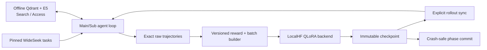

# HeteroSpawn-RL

HeteroSpawn-RL is a research implementation of dynamic Main/Sub agent spawning for
deep-research reinforcement learning. Its current runnable path uses:

- `Qwen/Qwen3-4B` with 4-bit QLoRA on an 11 GB Turing GPU;
- the pinned WideSeek-R1 training data and offline Wiki-2018 Search/Access environment;
- project-owned exact-token rollout, LoRA update, checkpoint, synchronization, and recovery;
- either a shared-policy baseline or independent Main/Sub policies with fresh alternating
  updates.

The complete setup and experiment sequence is in the
[Qwen3-4B + WideSeek end-to-end guide](docs/runbooks/qwen3-wideseek-end-to-end.md).
Use that guide as the operational source of truth.

## What works

The repository can currently run, through one resumable command:

1. verified asset download with official-to-mirror fallback;
2. answer-safe role-targeted SFT construction and a bounded Qwen3-4B SFT warm start;
3. real multi-round Main spawn and Sub Search/Access rollout against offline WideSeek;
4. one or more shared-policy RL cycles and independent Main-first fresh-alternating cycles;
5. exact token/log-probability training batches, immutable checkpoints, explicit rollout sync,
   and crash-safe phase recovery;
6. update-free held-out comparison of the SFT, shared-RL, and independent-RL checkpoints with
   paired task-cluster uncertainty.

This validates the architecture and training path. It does **not** reproduce WideSeek-R1's
large-scale distributed training or establish a competitive benchmark score. The latest
held-out comparison found no statistically reliable quality improvement after the bounded
one-cycle pilots; see the
[validation report](docs/validation/2026-07-27-qwen3-4b-heldout-sft-rl-comparison.md).

## Architecture



The domain and orchestration layers are provider-neutral. MiniMax, xbench, WideSeek,
LocalHF, and optional rollout engines live behind explicit interfaces. Roles, policies,
episodes, weight versions, rollout revisions, and environment revisions are structured
fields rather than prompt-derived conventions.

## Developer setup

For the CPU test suite:

```bash
python3.11 -m venv .venv
source .venv/bin/activate
python -m pip install --upgrade pip
python -m pip install -e ".[dev]"
python -m pytest
python -m ruff check .
python -m ruff format --check .
python -m mypy src
```

On Windows PowerShell, activate with `.venv\Scripts\Activate.ps1`. GPU experiments require
Linux and isolated QLoRA/retrieval environments as described in the end-to-end guide.

## Command map

Current Qwen3/WideSeek workflow:

| Command | Purpose |
| --- | --- |
| `wideseek-run` | Run/resume the canonical SFT → shared/independent RL → evaluation experiment |
| `wideseek-fetch-assets` | Download or verify pinned model, data, corpus, and retriever assets |
| `wideseek-inspect-data` | Validate a WideSeek split without exposing references |
| `wideseek-sft-dry-run` | Validate answer-safe role-targeted SFT construction |
| `wideseek-check-environment` | Verify offline Qdrant/E5 Search/Access |
| `wideseek-rollout-smoke` | Run one real Search-to-Access environment probe |
| `wideseek-compliance-baseline` | Evaluate base/shared/independent checkpoints with zero updates |
| `wideseek-sft-train` | Run the bounded multi-step shared-policy SFT warm start |
| `wideseek-train-cycle` | Run one versioned shared or independent RL cycle for diagnostics |
| `wideseek-recover-phase` | Recover a durable optimizer phase without replaying rollout |

Contract and historical diagnostics such as `local-contract-smoke`,
`vllm-rollout-contract-smoke`, the compatibility alias `wideseek-train-smoke`, xbench, and
API-backed commands remain available, but they are not the current Qwen3/WideSeek recipe.

## Documentation

- [Architecture baseline](HeteroSpawn_DeepResearch_RL_Project_Design.md)
- [End-to-end Qwen3/WideSeek guide](docs/runbooks/qwen3-wideseek-end-to-end.md)
- [WideSeek environment semantics](docs/benchmarks/wideseek-r1.md)
- [Architecture decision records](docs/adr/)
- [Validation report index](docs/validation/README.md)
- [Development log](docs/development-log.md)
- [Optional backend-spike runbook](docs/runbooks/remote-backend-spike.md)

Runtime assets, checkpoints, raw traces, retrieved text, and credentials must remain outside
Git or below ignored `artifacts/`. API credentials are accepted only through process
environment variables.
